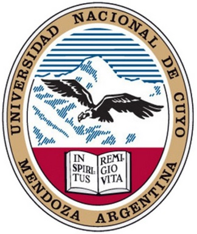

<h1 style="text-align: center;"> Proyecto Final de Estudios </h1>

<h2 style="text-align: center;"> Ingeniería en Mecatrónica </h2>

<h2 style="text-align: center;"> Facultad de Ingeniería - Universidad Nacional de Cuyo </h2>

<h1 style="text-align: center;"> Robot paralelo pick-and-place para la preparación de pedidos </h1>

<h3 style="text-align: center;">Ing. Eric Sanchez </h3>
<h3 style="text-align: center;">Autores: Aguero Emanuel, Lezcano Agustin </h3>
<h3 style="text-align: center;">Mendoza, Argentina </h3>
<h3 style="text-align: center;">2026 </h3>

El proyecto desarrollado consiste en el diseno e implementación de un sistema robótico paralelo para operativa pick-and-place, cuyo objetivo principal es trasladar objetos desde un punto inicial (A) hasta un punto final (B) a partir de su deteccion mediante técnicas de visióon artificial. El sistema esta orientado a manipular objetos que arriban desde lo que se simula ser una cinta transportadora, identificarlos dentro del espacio de trabajo y posicionarlos de manera precisa en un contenedor correspondiente a un pedido, simulando un flujo típico de procesos logísticos modernos.

Para esto, se realizo la modificación estructural y funcional de un robot modelo MK2, reemplazando sus servomotores originales por motores Paso a Paso en todas sus articulaciones, con el fin de mejorar la precision de posicionamiento y el control del movimiento. El efector final incorpora un electroiman que permite la sujeción de piezas metálicas durante el ciclo operativo.  

El desarrollo abarca múltiples areas: la modificación estructural hacia motores Paso a Paso; el calculo de la cinemática directa e inversa del manipulador; la integración y calibración de los motores; y la planificacion de trayectorias que permitan un movimiento suave, eficiente y seguro del robot. Asimismo, se integra un sistema de visión artificial basado en algoritmos de inferencia para 
la deteccion y localización de objetos en el entorno. 

Finalmente, se implementa una arquitectura de comunicacion mediante ROS2, por medio de la cual se establecen nodos dedicados a la interaccion entre la computadora encargada del procesamiento de vision y el envío de consignas de posición, y el microcontrolador STM32 responsable del control de los motores. Esta infraestructura permite el intercambio confiable de informacion entre los distintos módulos del sistema y constituye la base para la coordinación del proceso completo de manipulación robótica.
